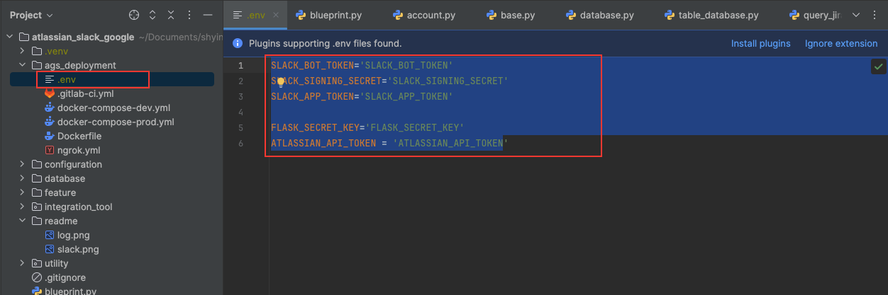

# Atlassian & Slack & Google Integration Hub

Integrate Atlassian & Slack & Google to reduce manual effort. <br>
Example: <br>
1. Create a routine Jira ticket.
2. Query the due date ticket and reminder assignee on the Slack channel.
3. Generate a report and record it on Confluence or send it via email.

---

# Dev Mode, Deployment, Debug
### Dev Mode
Option 1. Docker environment
```cd
$ make run-dev-docker
```

Option 2. Docker environment with HTTPS
```cd
$ make run-dev-docker-ngrok
```

### Debug
Which have same request_id in one workflow.


### Deployment
- .gitlab-ci.yml
- docker-compose-prod.py
- Dockerfile


# New Environment Set up
Before development, create `.env` file under `/ags_deployment`. <br>
Add the content below: <br>
```cd
SLACK_BOT_TOKEN='SLACK_BOT_TOKEN'
SLACK_SIGNING_SECRET='SLACK_SIGNING_SECRET'
SLACK_APP_TOKEN='SLACK_APP_TOKEN'

FLASK_SECRET_KEY='FLASK_SECRET_KEY'
ATLASSIAN_API_TOKEN = 'ATLASSIAN_API_TOKEN
```



# Operation / Testing
#### Request API
Example: <br>
```cd
curl --location 'http://127.0.0.1:8790/api/example/get_google_sheet'
```
### Result
Example: <br>

